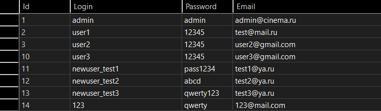
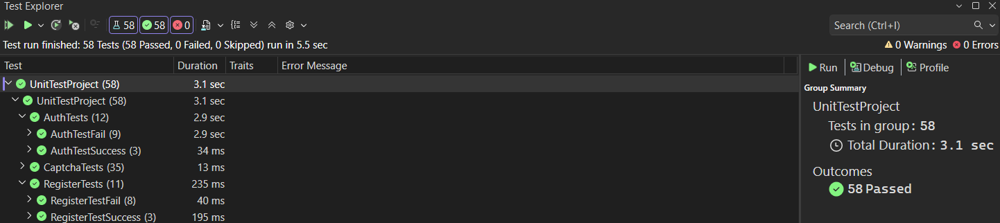

# Практическая работа №6 — Создание автоматизированных Unit-тестов (Часть 3)

## Разработчик
* **Студент:** Прокофьев Матвей
* **Группа:** 3ИСИП-123

## Таблица пользователей (Microsoft SQL Server)

База данных содержит 6 пользователей. Пользователи `newuser_test1`, `newuser_test2`, `newuser_test3` были добавлены автоматически в ходе выполнения позитивных тестов регистрации.

---

## Обозреватель тестов

---

## Результаты тестирования

Всего выполнено **58 тестов**, все пройдены успешно. Общее время выполнения — **3.1 сек**.

| Класс | Тестов | Время | Результат |
|---|---|---|---|
| AuthTests | 12 | 2.9 сек | Пройдены |
| CaptchaTests | 35 | 13 мс | Пройдены |
| RegisterTests | 11 | 235 мс | Пройдены |

### AuthTests (12 тестов)
- **AuthTestFail (9)** — негативные сценарии авторизации: пустые поля, несуществующий логин, неверный пароль, SQL-инъекция и др. Все тесты пройдены, так как метод `Auth` корректно отклоняет недопустимые данные.
- **AuthTestSuccess (3)** — позитивные сценарии: авторизация реальных пользователей из БД (`admin`, `user1`, `user2`). Тесты пройдены, так как данные совпадают с записями в таблице Users.

### CaptchaTests (35 тестов)
Тесты разделены на три группы:
- **IsCaptchaRequired** — проверка порогового значения (капча появляется после 3 неверных попыток). Тесты пройдены, граница срабатывания реализована корректно.
- **GenerateCaptchaText** — проверка длины, допустимых символов, случайности генерации, отсутствия визуально похожих символов. Тесты пройдены.
- **ValidateCaptcha** — проверка корректного и некорректного ввода, обработки null, пустых строк, пробелов, регистронезависимости. Тесты пройдены.

### RegisterTests (11 тестов)
- **RegisterTestFail (8)** — негативные сценарии регистрации: пустые поля, одинаковые email-ы, несовпадение паролей, слишком короткий пароль, уже существующий логин. Тесты пройдены.
- **RegisterTestSuccess (3)** — позитивные сценарии: успешная регистрация новых пользователей. Тесты пройдены; пользователи `newuser_test1`, `newuser_test2`, `newuser_test3` были добавлены в БД.

---

## Вывод

Все 58 автоматизированных тестов пройдены успешно. Модули авторизации и регистрации корректно обрабатывают как допустимые, так и недопустимые входные данные. Рефакторинг кода — вынесение логики в отдельные методы `Auth`, `Register`, `ValidateCaptcha`, `GenerateCaptchaText`, `IsCaptchaRequired` — позволил обеспечить полное покрытие тестами без зависимости от UI-элементов. Реализована капча с шумом, которая активируется после трёх неверных попыток входа и успешно протестирована 35 автоматизированными тестами.
